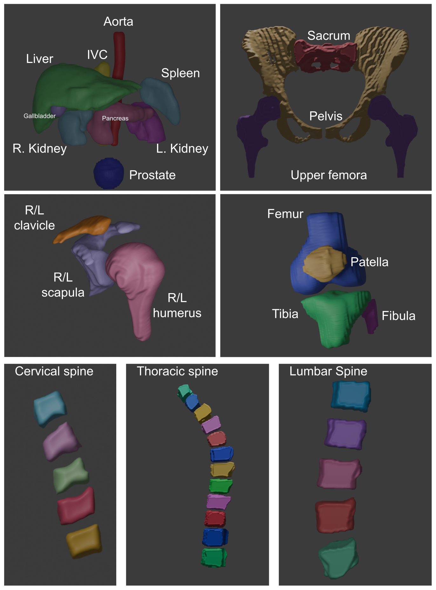

# MRAnnotator: Multi-Anatomy and Many-Sequence MRI Segmentation of Forty-four Structures
MRAnnotator is a tool for segmenting 44 anatomical structures in MR images across various sequences. A holdout independent test dataset can be downloaded here: .

Main classes for MRAnnotator:


# Installation
The model weights of MRAnnotator can be downloaded via the request: . 

Package dependency:
* Python >= 3.9
* [Pytorch](http://pytorch.org/) >= 2.0.0 according to your hardware (cuda, mps, cpu).

MRAnnotator is developed on nnU-Net V2(version>=2.3.1) and follow the installation instruction from https://github.com/MIC-DKFZ/nnUNet/tree/master.
```
pip install nnunetv2
```
or
```
git clone https://github.com/MIC-DKFZ/nnUNet.git
cd nnUNet
pip install -e .
```
# Usage
To prepare the data for segmentation, the input image data (in nifti format) should be placed in LAS orientation. This setting could help MRANnotator determine the laterality of the image volume.  

MRAnnotator contains model weights specifically for abdomen (Task_number:001), shoulder(Task_number:002), knee(Task_number:003), pelvis(Task_number:004), and spine(Task_number:005). 
```
CUDA_VISIBLE_DEVICES=0 nnUNetv2_predict -i image_path  -o  prediction_path  -d Task_number -c 3d_fullres -f 0 -tr nnUNetTrainerNoMirroring
```

# Class details
Here you can find the classes of each Task:

|Index of Task001 Abdomen|Class name|
|:-----|:-----|
1 | spleen |
2 | kidney_right |
3 | kidney_left |
4 | gallbladder |
5 | liver |
6 | aorta |
7 | inferior vena cava |
8 | pancreas | 

# Citation
Please cite the following paper if using MRAnnotator model weights or the benchmark houldout test dataset:
```
```
